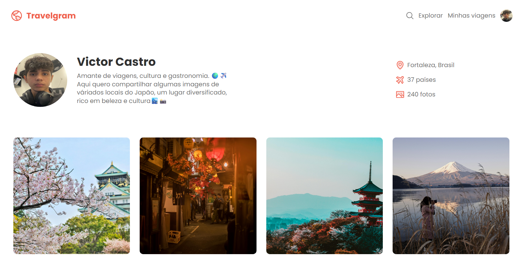

 

    

## 💻 Travelgram Responsive
This is a responsive web project created to learn and master HTML and CSS. It focuses on adding responsiveness to a previous project, refactoring the code, and enhancing the website with new features. 

## ⚙️ Technologies Used
This project was developed using the following technologies:

- HTML
- CSS
- GIT E Github

## 🏷️ Layout
You can view the project layout through [this link](https://www.figma.com/community/file/1392188119249243534).
Note: A Figma account is required [Figma](https://www.figma.com).
